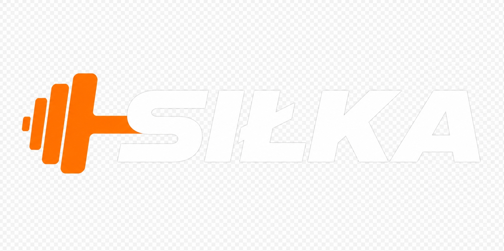
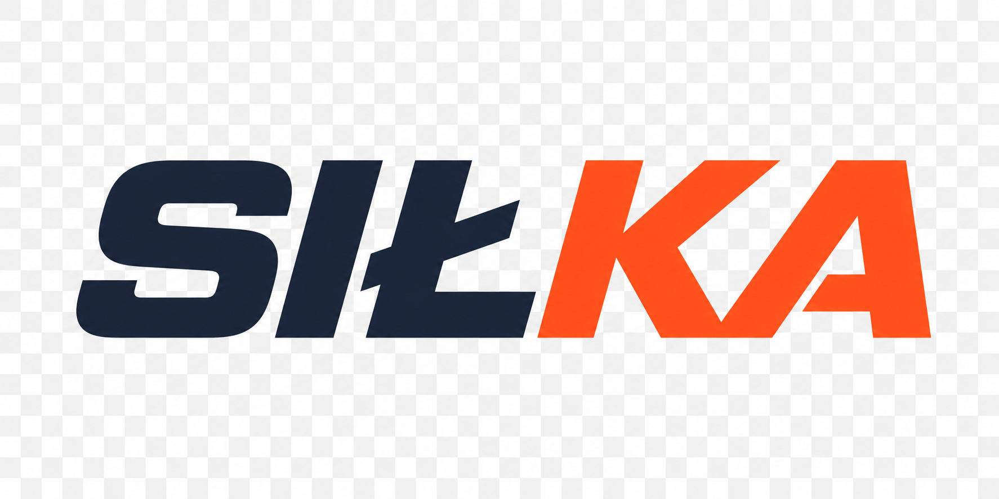

# Propozycja nowego logo – SIŁKA

## TL;DR
Nowa nazwa: **siłka**  
Stare kolory (limonka #B5D334 + czerń) → nowe: **pomarańcz #FF6B35 + granat #1E293B + cyan #06B6D4** – zgodnie z design systemem w `src/styles.css`.

Zaproponowano 4 kierunki, wszystkie w folderze `src/assets/img/logo-silka/`:

### Rekomendacja: Wariant 02 – Hantla + SIŁKA
**Plik wdrożony:** `src/assets/img/logo.png` (transparent, biała SIŁKA + pomarańczowa hantla)



- Idealny do headera (ciemny granat #1E293B)
- Natychmiast komunikuje siłownię
- Wysoki kontrast, czytelny z daleka
- Pasuje do przycisków CTA #FF6B35

Wersja na jasne tło: `logo-light.png`



### Pozostałe propozycje

1. **Wordmark Split** – `SIŁ` granat/biały + `KA` pomarańcz, ultra minimal, Poppins ExtraBold
2. **Badge SIŁKA 24** – ewolucja starego SFC, ten sam skośny kształt, nowe kolory, zachowuje ciągłość
3. **Lowercase** – "siłka" małe litery, friendly, z akcentem cyan
4. **Ikona S** – litera S jako hantla, do favicon / social

### Podgląd na żywo
Uruchomiono serwer na porcie 4200 – otwórz `preview.html`:

```
src/assets/img/logo-silka/preview.html
```

Zawiera:
- wszystkie warianty na ciemnym/jasnym tle
- mock headera strony
- specyfikację kolorów i fontów
- rekomendację wdrożenia

### Wdrożone pliki produkcyjne
- `src/assets/img/logo.png` – NOWE logo (podmienione, stare zachowane jako `logo_old_sfc.png`)
- `src/assets/img/logo-light.png` – wersja jasna
- `src/assets/img/logo-dark.png` – wersja ciemna
- `src/assets/img/logo-icon.png` – ikona

Wszystkie SVG wektorowe gotowe do edycji w Figma/Illustrator znajdują się w `src/assets/img/logo-silka/`.

### Dlaczego takie kolory?
- Header strony to `rgba(30,41,59,0.95)` – czyli #1E293B, logo białe ma kontrast 15:1 (WCAG AAA)
- Przyciski primary to #FF6B35 z shadow `0 4px 14px rgba(255,107,53,0.35)` – pomarańczowa hantla naturalnie współgra
- Font Poppins 800/900 to `--font-heading` z design systemu – spójność

### Co dalej?
1. Wybierz 1 z 4 kierunków (rekomenduję 02)
2. Jeśli chcesz zachować "24", wybierz Badge
3. Mogę wygenerować favicon, social pack, wersję mono, animowaną wersję do hero

---

Autor: Agent Mode – propozycje wygenerowane AI + ręczne SVG zgodne z design tokens.
